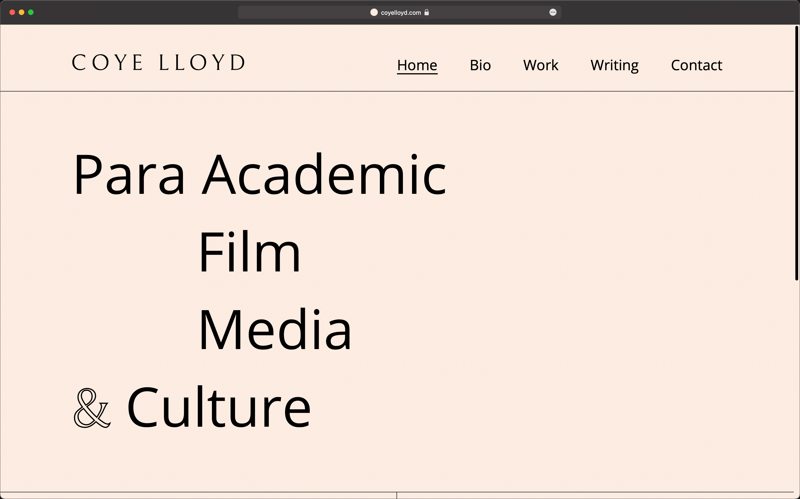

This project was built for freelance film scholar, writer, & podcaster <a href="https://coyelloyd.com/" target="_blank" rel="noopener">
Coye Lloyd</a>.

## Goals

- Fast and accessible
- Aesthetically appropriate design for Coye Lloyd
- Easy to use CMS for the end user

## Technologies, skills, etc.

- <a href="https://nextjs.org/" target="_blank" rel="noopener">
    Next.js
  </a>
  , a React based framework
- <a href="https://sanity.io" target="_blank" rel="noopener">
    Sanity.io
  </a>
  , a modern CMS solution.{' '}
- JavaScript
- <a href="https://cube.fyi/" target="_blank" rel="noopener noreferrer">
    Cube CSS
  </a> & <a
    href="https://every-layout.dev/"
    target="_blank"
    rel="noopener noreferrer"
  >
    Every Layout
  </a>
  .
- Responsive web design
