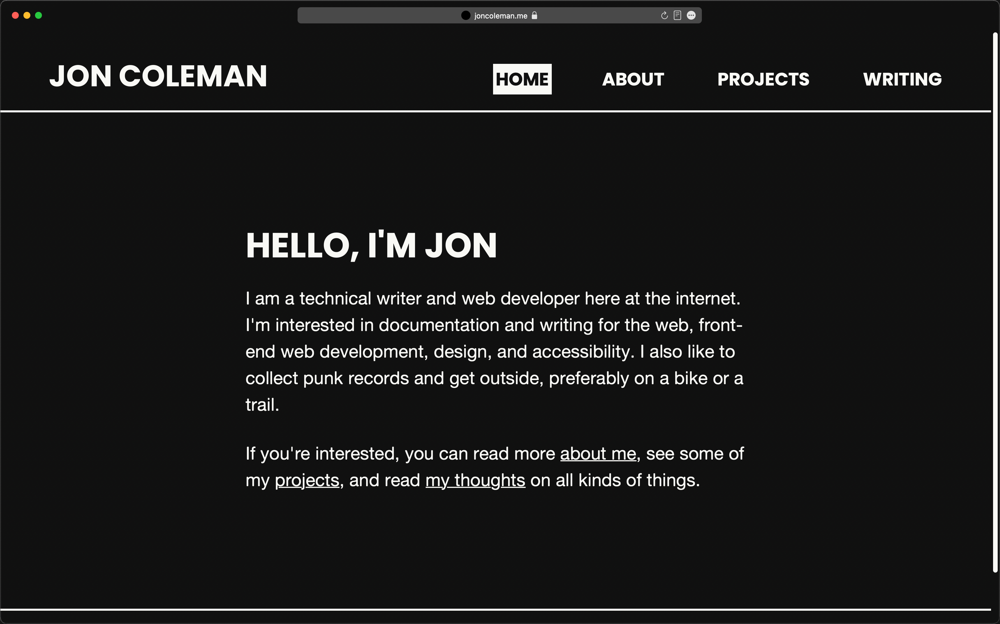

For this site, I wanted to create something that is fast and accessible, but also reflects my personality and tastes.

## Goals

- Fast and accessible
- Aesthetically "me"
- Clean, semantic markup
- Minimal CSS with maximum effect

## Technologies, skills, etc.

- <a href="https://www.gatsbyjs.com" target="_blank" rel="noopener noreferrer">
    Gatsby
  </a>
  , a popular static site generator built on React.
- <a href="https://cube.fyi/" target="_blank" rel="noopener noreferrer">
    Cube CSS
  </a> & <a
    href="https://every-layout.dev/"
    target="_blank"
    rel="noopener noreferrer"
  >
    Every Layout
  </a>
  .
- Markdown for source content and GraphQL for querying the data.
- Punk records for design.

Find the code in <a href="https://github.com/z336/jon-coleman" target="_blank" rel="noopener noreferrer">GitHub</a>. The site is deployed directly from GitHub via <a href="https://www.netlify.com/" target="_blank" rel="noopener noreferrer">Netlify</a>.
